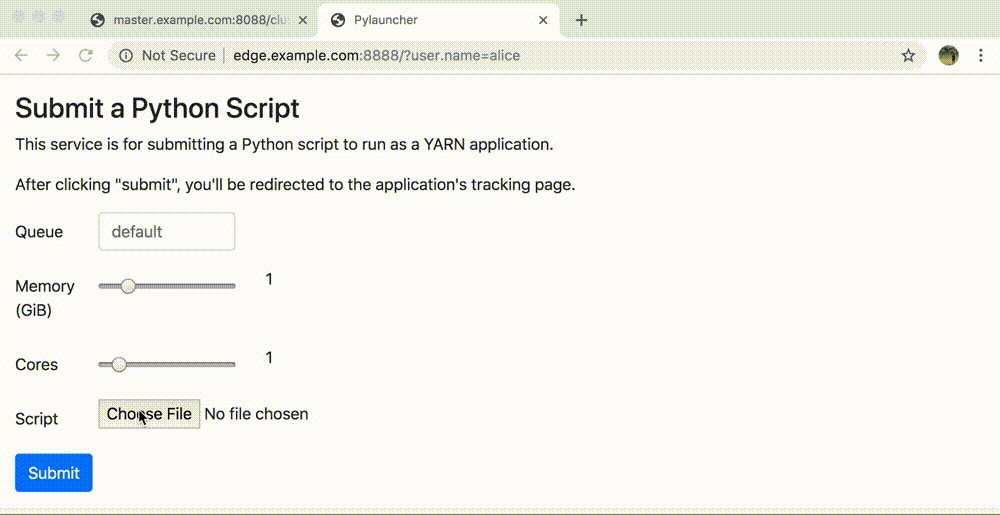

Python Service Example
======================

Skein fully supports Hadoop's security model, and can be used to write long
running services that interact with YARN on behalf of other users.

This example provides a simple web service that allows users to submit Python
scripts to be run on a YARN cluster. The service is intended to be run as a
privileged user with `proxy user`_ permissions. It can be secured using
Kerberos_ (in which case a keytab must be provided), or "simple" authentication
(matching Hadoop's "simple" auth scheme).

Dependencies
------------

This example requires ``tornado`` in addition to ``skein``. If using Kerberos_
for security, it also requires ``pykerberos``. These can be installed using
either ``conda`` or ``pip``.

Enable Proxy-User Permissions
-----------------------------

This service makes full use of Hadoop's security model, and will submit the
scripts to run in containers with the requesting user's permissions (e.g. if
``alice`` submits a script, this script will run as user ``alice``). To
accomplish this, the service needs `proxy user`_ permissions.  This allows the
service to perform actions impersonating another user.

To enable this you'll need to do the following:

1. Create a user for the service to run under. Here we'll use ``pyservice``.

2. Enable `proxy user`_ permissions for this user. The users ``pyservice`` has
   permission to impersonate can be restricted to certain groups, and requests
   to impersonate may be restricted to certain hosts.

   .. code-block:: xml

      <property>
        <name>hadoop.proxyuser.pyservice.hosts</name>
        <value>host-where-the-service-is-running</value>
      </property>
      <property>
        <name>hadoop.proxyuser.pyservice.groups</name>
        <value>group1,group2</value>
      </property>

   If looser restrictions are acceptable, you may also use the wildcard ``*``
   to allow impersonation of any user or from any host.

   .. code-block:: xml

      <property>
        <name>hadoop.proxyuser.pyservice.hosts</name>
        <value>*</value>
      </property>
      <property>
        <name>hadoop.proxyuser.pyservice.groups</name>
        <value>*</value>
      </property>

   See the `proxy user`_ documentation for more information.

Enable Kerberos Security (Optional)
~~~~~~~~~~~~~~~~~~~~~~~~~~~~~~~~~~~

If your cluster has Kerberos enabled, you'll also need to create a principal
and keytab for the service user (we'll continue using ``pyservice`` for this,
as above). You'll also want to create an HTTP principal so the web requests to
the service are also authenticated with kerberos.

.. code-block:: shell

    # Create the pyservice principal
    $ kadmin -q "addprinc -randkey pyservice"

    # Add the HTTP principal
    $ kadmin -q "addprinc -randkey HTTP/FQDN"

    # Create a keytab with both
    $ kadmin -q "xst -norandkey -k /path/to/pyservice.keytab pyservice HTTP/FQDN"

where ``FQDN`` is the `fully qualified domain name`_ of the host running the
service.

Store the keytab file wherever you see fit.

Running
-------

To run, make sure you've installed all required dependencies in your current
environment, and you're running as the same user created above.

.. code:: console

    # Start the application
    $ python pyservice.py

    # Or if kerberos is enabled
    $ python pyservice.py --keytab /path/to/pyservice.keytab --principal pyservice

The service will then be accessible on port ``8888``. To use, write a Python
script and save it locally. For example:

.. code-block:: python

    # example.py
    from getpass import getuser
    print("Hello from in a YARN container!")
    print("I'm running as user %s" % getuser())

After uploading the script, the application is started as the user logged in to
the web application (in the GIF below this is ``alice``), and the browser is
redirected to the tracking page for that application.

After completion, we can view the application logs to verify things worked
properly (trimmed for brevity):

.. code-block:: console

    $ skein application logs application_1567544213463_0010 --user alice
    ** Logs for application_1567544213463_0010 **

    container_1567544213463_0018_01_000001
    ======================================
    LogType:application.driver.log
    Log Upload Time:Wed Sep 04 15:22:35 +0000 2019
    LogLength:58
    Log Contents:
    Hello from in a YARN container!
    I'm running as user alice

.. _proxy user: https://hadoop.apache.org/docs/current/hadoop-project-dist/hadoop-common/Superusers.html
.. _kerberos: https://en.wikipedia.org/wiki/Kerberos_(protocol)
.. _fully qualified domain name: https://en.wikipedia.org/wiki/Fully_qualified_domain_name
